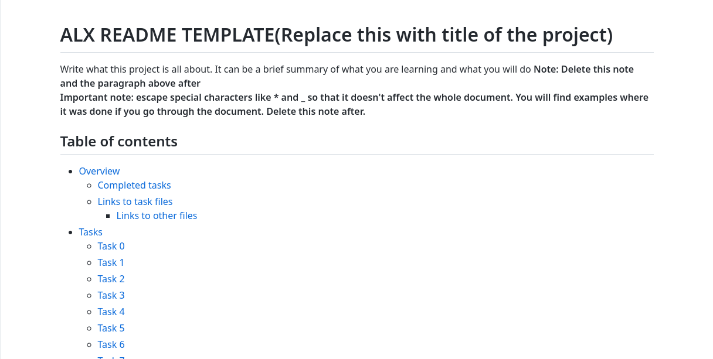
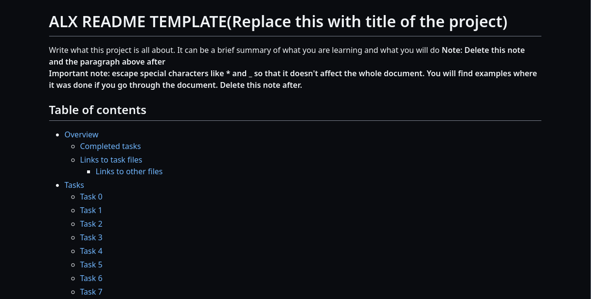

# ALX README TEMPLATE
This is a ready made template which can be used for your README.md task in ALX. All you need to do is some minor editing and don't forget to remove the notes and paragraph where stated  

It contains two versions:
1. [Regular](./README-template.md)
2. [Simplified](./README-template-simplified.md)

**Read Me:** _Don't forget to give this repository a star if you find it useful and also come back to check for updates_

## Table of Content

- [Overview](#overview)
  - [Preview](#preview)
  - [Links](#links)
- [Usage](#usage)
- [Useful resource](#useful-resource)
- [Author](#author)
- [Acknowledgments](#acknowledgments)
- [Contribute](#contribute)

## Overview

### Preview

  
_Light background_

  
_Dark background_

### Links

- Link to this repository: [alx-readme-template](https://github.com/Evil-Ghost/alx-readme-template)

## Usage

You can either clone, fork or download this repository to use it.  
The file needed is **README-template.md**. You need to copy this file to your project that you are working on, edit it to your taste but don't remove the **Credits** and **Link to template** tags, then rename it to README.md

There is also a simplified version **README-template-simplified** for those who already get the hang of everything and writing markdown files. You also don't have to delete the notes because they have already been removed. Use the simplified version only if you already know your way around writing mardown files efficiently

## Useful resource

For those that don't have any idea how markdowns are written or you are having troubles editing the **README-template.md** file, I put in a link to a tutorial below that you will find very useful

- [Markdown Tutorial](https://www.markdowntutorial.com/)

## Author

This template is made possible and written by:
- GitHub - [Evil-Ghost](https://github.com/Evil-Ghost)
- Twitter - [@Evil\_Ghost\_\_](https://www.twitter.com/evil_ghost__)
- Medium - [Evil Ghost](https://medium.com/@evilghost)
- Website - [Coming soon...](#)

## Acknowledgments

All thanks to [Frontendmentor](frontendmentor.io) and [Markdown Tutorial](https://www.markdowntutorial.com/) for inspiring me to do this

## Contribute

If you want to contribute to this project you can send me a [mail](mailto:danielaisosajoseph@gmail.com) or a message on [Twitter](https://www.twitter.com/evil_ghost__)  
